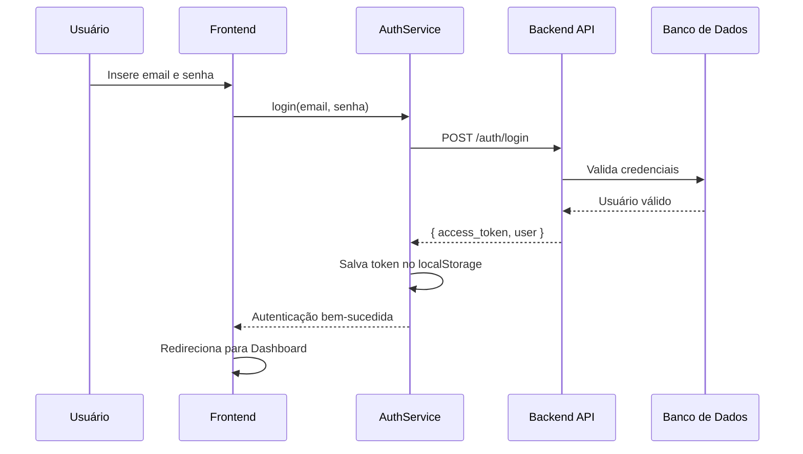
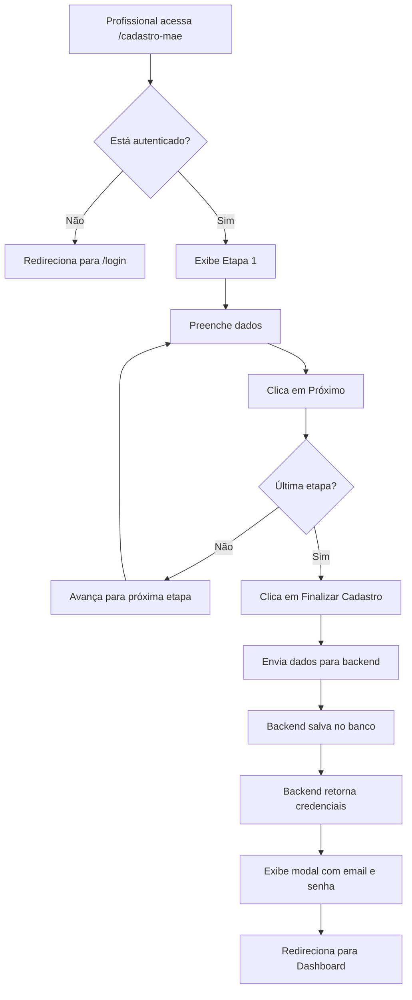
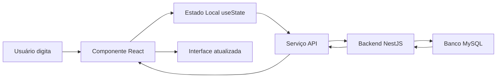
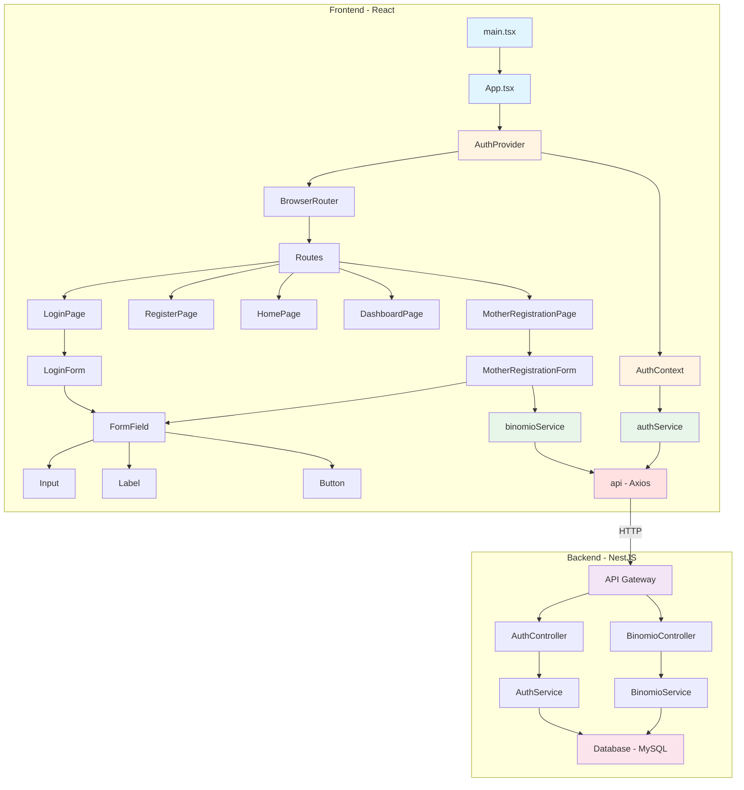

# Documentação do Projeto Frontend

## Arquitetura e Tecnologias

### Stack Tecnológico

O projeto usa tecnologias modernas de desenvolvimento web:

| Tecnologia | Versão | Para que serve |
|------------|--------|----------------|
| **React** | 19.1.1 | Biblioteca JavaScript para criar interfaces de usuário interativas |
| **TypeScript** | 5.9.3 | Adiciona tipagem estática ao JavaScript, prevenindo erros |
| **Vite** | 7.1.7 | Ferramenta de build super rápida para desenvolvimento |
| **TailwindCSS** | 4.1.14 | Framework CSS para estilização rápida e responsiva |
| **React Router** | 7.9.3 | Gerencia navegação entre páginas |
| **Axios** | 1.13.2 | Faz requisições HTTP para o backend |
| **Lucide React** | 0.544.0 | Biblioteca de ícones modernos |

### Arquitetura do Projeto

O projeto segue o padrão **Atomic Design** para organização de componentes:

```
Átomos → Moléculas → Organismos → Templates → Páginas
```

**Como funciona:**
- **Átomos**: Componentes mais básicos (botões, inputs, labels)
- **Moléculas**: Combinação de átomos (campo de formulário = label + input)
- **Organismos**: Componentes complexos (formulário completo de login)
- **Páginas**: Telas completas da aplicação

---

## Estrutura de Pastas

```
front-end/
├── public/                    # Arquivos públicos estáticos
├── src/                       # Código fonte da aplicação
│   ├── assets/               # Imagens, fontes, etc.
│   ├── atoms/                # Componentes atômicos
│   │   ├── Button.tsx        # Botão reutilizável
│   │   ├── Input.tsx         # Campo de entrada
│   │   ├── Label.tsx         # Rótulo de campo
│   │   ├── Select.tsx        # Seletor dropdown
│   │   └── Checkbox.tsx      # Caixa de seleção
│   ├── molecules/            # Componentes moleculares
│   │   └── Field.tsx         # Campo completo (label + input + botão)
│   ├── organisms/            # Componentes complexos
│   │   ├── LoginForm.tsx     # Formulário de login
│   │   ├── RegisterForm.tsx  # Formulário de registro
│   │   └── MotherRegistrationForm.tsx  # Formulário de cadastro de mães
│   ├── components/           # Componentes auxiliares
│   │   ├── ProtectedRoute.tsx        # Proteção de rotas autenticadas
│   │   ├── FormStepIndicator.tsx     # Indicador de etapas do formulário
│   │   └── CredentialsModal.tsx      # Modal de credenciais
│   ├── pages/                # Páginas da aplicação
│   │   ├── HomePage.tsx              # Página inicial
│   │   ├── LoginPage.tsx             # Página de login
│   │   ├── RegisterPage.tsx          # Página de registro
│   │   ├── DashboardPage.tsx         # Painel de controle
│   │   └── MotherRegistrationPage.tsx # Página de cadastro de mães
│   ├── contexts/             # Contextos React (estado global)
│   │   └── AuthContext.tsx   # Gerencia autenticação do usuário
│   ├── services/             # Serviços de comunicação com API
│   │   ├── api.ts            # Configuração base do Axios
│   │   ├── auth.service.ts   # Serviço de autenticação
│   │   └── binomio.service.ts # Serviço de cadastro binômio
│   ├── types/                # Definições de tipos TypeScript
│   │   ├── auth.types.ts     # Tipos relacionados à autenticação
│   │   └── binomio.types.ts  # Tipos do cadastro binômio
│   ├── App.tsx               # Componente raiz da aplicação
│   ├── main.tsx              # Ponto de entrada da aplicação
│   └── index.css             # Estilos globais
├── package.json              # Dependências e scripts
├── tsconfig.json             # Configuração TypeScript
├── vite.config.ts            # Configuração Vite
└── tailwind.config.js        # Configuração TailwindCSS
```

---

## Sistema de Autenticação

### Como funciona?

O sistema usa **JWT (JSON Web Tokens)** para autenticação segura:

1. **Login**: Usuário envia email e senha
2. **Backend valida**: Verifica credenciais no banco de dados
3. **Token gerado**: Backend cria um token JWT único
4. **Token armazenado**: Frontend guarda o token no `localStorage`
5. **Requisições autenticadas**: Todas as requisições incluem o token no cabeçalho

### Fluxo de Autenticação



### Arquivos Envolvidos

#### 1. **AuthContext.tsx** - Gerenciador de Estado Global

**O que faz:**
- Mantém o estado de autenticação em toda a aplicação
- Fornece funções de login/logout
- Verifica se usuário está autenticado


**Principais funções:**
- `login(email, password)`: Autentica o usuário
- `logout()`: Remove token e desloga
- `isAuthenticated`: Verifica se está logado
- `user`: Informações do usuário atual
- `token`: Token JWT atual

#### 2. **auth.service.ts** - Comunicação com Backend

**O que faz:**
- Faz requisições de autenticação para o backend
- Gerencia armazenamento de tokens
- Fornece métodos para verificar autenticação

**Principais métodos:**
- `login()`: Envia credenciais e recebe token
- `logout()`: Limpa dados de autenticação
- `getToken()`: Retorna token atual
- `getCurrentUser()`: Retorna usuário logado
- `isAuthenticated()`: Verifica se há token válido

#### 3. **api.ts** - Configuração HTTP
**O que faz:**
- Cria instância do Axios configurada
- Adiciona automaticamente token JWT em todas requisições
- Intercepta erros (ex: token expirado → redireciona para login)

**Interceptadores:**
- **Request**: Adiciona `Authorization: Bearer <token>` em cada requisição
- **Response**: Se receber erro 401 (não autorizado), limpa autenticação e redireciona para login

#### 4. **ProtectedRoute.tsx** - Proteção de Rotas
**O que faz:**
- Protege páginas que exigem autenticação
- Redireciona usuários não autenticados para login

---

## Sistema de Cadastro de Binômio

### O que é cadastrado?

O formulário coleta **informações completas** sobre mães e bebês, dividido em **6 etapas**:

#### **Etapa 1: Dados Sociodemográficos**
- Idade da mãe
- Data de nascimento
- Etnia (Branca, Preta, Amarela, Parda, Indígena)
- Estado civil
- Escolaridade (anos de estudo)
- Renda familiar
- Número de consultas pré-natal

#### **Etapa 2: Hábitos e Saúde**
- Tabagismo (frequência)
- Consumo de bebida alcoólica
- Uso de drogas
- Medicação contínua

#### **Etapa 3: Histórico Clínico**
- Condições psicológicas (depressão, ansiedade, etc.)
- Obesidade / Desnutrição
- Diabetes (prévia ou gestacional)
- Hipertensão (prévia ou gestacional)
- Cirurgia bariátrica
- Distúrbios de tireoide
- Cirurgia mamária

#### **Etapa 4: Histórico Obstétrico**
- Paridade (primeira gravidez ou não)
- Amamentação anterior
- Rede de apoio (companheiro, família, amigos)
- Cursos sobre amamentação
- Propaganda de fórmula
- Tipo de concepção

#### **Etapa 5: Dados do Parto e Bebê**
- Data do parto
- Local do parto
- Hospital Amigo da Criança (IHAC)
- Tipo de parto (normal, cesárea, fórceps)
- Sexo do bebê
- Idade gestacional
- Peso ao nascer
- Apgar (1 e 5 minutos)
- Alojamento conjunto
- Método canguru

#### **Etapa 6: Amamentação**
- Formato das mamas e mamilos
- Amamentou na primeira hora
- Amamentação nas primeiras 24h
- Dispositivos usados (mamadeira, chupeta)
- Dificuldades encontradas
- Escalas de autoeficácia
- Icterícia neonatal
- Fototerapia
- Retorno ao trabalho
- Banco de leite

### Fluxo do Cadastro



### Arquivos Envolvidos

#### 1. **MotherRegistrationForm.tsx** - Formulário Multi-Etapas
**O que faz:**
- Gerencia 6 etapas do formulário
- Valida e armazena dados temporariamente
- Envia dados completos ao backend
- Exibe modal com credenciais geradas

**Estado principal:**
- `currentStep`: Etapa atual (1-6)
- `formData`: Todos os dados preenchidos
- `loading`: Indica se está enviando
- `error`: Mensagens de erro
- `credentials`: Email e senha gerados pelo backend

**Componentes de etapa:**
- `Step1`: Dados sociodemográficos
- `Step2`: Hábitos e saúde
- `Step3`: Histórico clínico
- `Step4`: Histórico obstétrico
- `Step5`: Dados do parto
- `Step6`: Amamentação

#### 2. **binomio.service.ts** - Comunicação com API
**O que faz:**
- Envia dados do cadastro para o backend
- Busca cadastros existentes
- Atualiza cadastros

**Principais métodos:**
- `registerBinomio(data)`: Cria novo cadastro
- `getBinomioById(id)`: Busca cadastro por ID
- `updateBinomio(id, data)`: Atualiza cadastro existente

#### 3. **binomio.types.ts** - Definições de Tipos
**O que faz:**
- Define estrutura de dados do cadastro
- Garante tipagem correta em TypeScript
- Documenta campos obrigatórios e opcionais

**Principais interfaces:**
- `BinomioRegistrationData`: Todos os campos do cadastro
- `BinomioFormStep1-6`: Dados de cada etapa
- `UserCredentials`: Email e senha gerados
- `BinomioRegistrationResponse`: Resposta do backend

---

## Componentes Atômicos

### Button.tsx
**O que faz:** Botão reutilizável com estilos personalizáveis

**Props:**
- `onClick`: Função executada ao clicar
- `disabled`: Desabilita o botão
- `className`: Classes CSS customizadas
- `children`: Texto ou conteúdo do botão

### Input.tsx
**O que faz:** Campo de entrada de texto/número/data

**Props:**
- `type`: Tipo do input (text, email, password, number, date)
- `value`: Valor atual
- `onChange`: Função chamada ao digitar
- `placeholder`: Texto de exemplo
- `required`: Campo obrigatório

### Label.tsx
**O que faz:** Rótulo para campos de formulário

**Props:**
- `htmlFor`: ID do campo associado
- `className`: Classes CSS
- `children`: Texto do rótulo

### Select.tsx
**O que faz:** Menu dropdown de seleção

**Props:**
- `options`: Array de opções `[{ value, label }]`
- `value`: Opção selecionada
- `onChange`: Função ao selecionar
- `placeholder`: Texto quando nada está selecionado

### Checkbox.tsx
**O que faz:** Caixa de seleção múltipla

**Props:**
- `checked`: Se está marcado
- `onChange`: Função ao marcar/desmarcar
- `label`: Texto ao lado da caixa
- `value`: Valor do checkbox

---

## Componentes Moleculares

### Field.tsx
**O que faz:** Campo completo de formulário (label + input + botão opcional)

**Uso típico:**
```tsx
<FormField
  htmlForLabel="email"
  childrenLabel="Email"
  idInput="email"
  typeInput="email"
  valueInput={email}
  onChangeInput={(e) => setEmail(e.target.value)}
  required
/>
```

**Características:**
- Combina Label + Input
- Suporta botão adicional (ex: mostrar/ocultar senha)
- Campo de senha com ícone de olho

---

## Componentes de Interface

### FormStepIndicator.tsx
**O que faz:** Mostra progresso visual das etapas do formulário

**Exemplo visual:**
```
[1] ━━━ [2] ━━━ [3] ─── [4] ─── [5] ─── [6]
 ✓       ✓       ●       ○       ○       ○
```

- **Etapas concluídas**: Marcadas com ✓
- **Etapa atual**: Destacada
- **Etapas futuras**: Cinza

### CredentialsModal.tsx
**O que faz:** Exibe modal com credenciais geradas após cadastro

**Informações mostradas:**
- Email gerado automaticamente
- Senha gerada automaticamente
- ID do usuário
- Botão para copiar credenciais
- Aviso para guardar as informações

---

## Rotas da Aplicação

### Configuração de Rotas (App.tsx)

| Rota | Componente | Protegida? | Descrição |
|------|-----------|-----------|-----------|
| `/login` | LoginPage | Não | Página de login |
| `/register` | RegisterPage | Não | Registro de novos usuários |
| `/` | HomePage | Sim | Página inicial (requer login) |
| `/dashboard` | DashboardPage | Sim | Painel de controle |
| `/cadastro-mae` | MotherRegistrationPage | Sim | Cadastro de binômio |

**Rotas protegidas** usam o componente `<ProtectedRoute>` que:
1. Verifica se usuário está autenticado
2. Se sim, exibe a página
3. Se não, redireciona para `/login`

---

## 🔄 Fluxo de Dados

### Como os dados fluem na aplicação?



### Exemplo Prático: Login

1. **Usuário digita** email e senha no `LoginForm`
2. **Estado local** armazena valores temporariamente
3. **Ao submeter**, chama `onSubmit(email, password)`
4. **LoginPage** chama `AuthContext.login()`
5. **AuthContext** chama `authService.login()`
6. **authService** faz `POST /auth/login` via Axios
7. **Backend** valida credenciais no MySQL
8. **Backend** retorna `{ access_token, user }`
9. **authService** salva token no `localStorage`
10. **AuthContext** atualiza estado global
11. **App** detecta autenticação e redireciona para `/`

---

## Armazenamento Local

### O que é salvo no navegador?

O sistema usa `localStorage` para persistir dados:

| Chave | Conteúdo | Quando é salvo |
|-------|----------|----------------|
| `access_token` | Token JWT | Após login bem-sucedido |
| `user` | Objeto JSON do usuário | Após login (se retornado) |

**Por que usar localStorage?**
- Dados persistem mesmo após fechar o navegador
- Usuário não precisa fazer login toda vez
- Token é enviado automaticamente em requisições

**Quando é limpo?**
- Ao fazer logout manualmente
- Quando token expira (erro 401)
- Ao limpar dados do navegador

---

## Principais Funcionalidades

### 1. Autenticação Segura
- Login com email e senha
- Token JWT com expiração
- Proteção automática de rotas
- Logout seguro

### 2. Cadastro Multi-Etapas
- Formulário dividido em 6 etapas
- Validação de campos
- Navegação entre etapas
- Indicador visual de progresso

### 3. Campos Dinâmicos
- Campos condicionais (aparecem conforme respostas)
- Seleção múltipla (checkboxes)
- Validação de tipos (números, datas, textos)

### 4. Geração de Credenciais
- Backend cria email e senha automaticamente
- Modal exibe credenciais após cadastro
- Opção de copiar credenciais

### 5. Interceptação de Requisições
- Token adicionado automaticamente
- Tratamento de erros centralizado
- Redirecionamento em caso de não autorização

---

## Como Executar o Projeto

### Pré-requisitos
- Node.js (versão 18+)
- Yarn ou npm
- Backend rodando em `http://localhost:3000`

### Instalação

```bash
# 1. Instalar dependências
yarn install

# 2. Iniciar servidor de desenvolvimento
yarn run dev

# 3. Acessar no navegador
# http://localhost:5173
```

---

## Comunicação com Backend

### Endpoint Base
```
http://localhost:3000
```

### Endpoints Utilizados

#### Autenticação
```http
POST /auth/login
Content-Type: application/json

{
  "email": "usuario@exemplo.com",
  "password": "senha123"
}

Response:
{
  "access_token": "eyJhbGciOiJIUzI1NiIs...",
  "user": {
    "id": "uuid",
    "email": "usuario@exemplo.com"
  }
}
```

#### Cadastro de Binômio
```http
POST /binomio/cadastro
Authorization: Bearer <token>
Content-Type: application/json

{
  "idade_mae": 28,
  "etnia_mae": "4",
  "renda": "3",
  ...
}

Response:
{
  "cadastro": {
    "id_binomio": 123,
    ...
  },
  "userCredentials": {
    "email": "mae123@sistema.com",
    "senha": "senha_gerada",
    "id_user_mae": 456
  }
}
```

#### Buscar Binômio
```http
GET /binomio/:id
Authorization: Bearer <token>

Response:
{
  "id_binomio": 123,
  "idade_mae": 28,
  ...
}
```

#### Atualizar Binômio
```http
PUT /binomio/:id
Authorization: Bearer <token>
Content-Type: application/json

{
  "idade_mae": 29
}
```

---

## Estilização

### TailwindCSS

O projeto usa **TailwindCSS** para estilização:

**Vantagens:**
- Classes utilitárias prontas
- Design responsivo fácil
- Consistência visual
- Sem CSS customizado

**Exemplo de classes usadas:**
```tsx
<div className="max-w-4xl mx-auto">           {/* Container centralizado */}
  <div className="bg-white p-8 rounded-lg">   {/* Card branco com padding */}
    <input className="w-full px-4 py-2 
                      bg-gray-100 
                      rounded-lg 
                      focus:ring-2 
                      focus:ring-blue-500" />  {/* Input estilizado */}
  </div>
</div>
```

### Padrões de Estilo

**Cores principais:**
- Azul (`blue-600`): Botões primários
- Verde (`green-600`): Ações de sucesso
- Vermelho (`red-600`): Erros e alertas
- Cinza (`gray-100-900`): Backgrounds e textos

**Espaçamentos:**
- `p-4, p-8`: Padding interno
- `mb-4, mt-8`: Margens
- `space-y-4`: Espaçamento vertical entre elementos

---

## TypeScript e Tipagem

### Por que TypeScript?

**Benefícios:**
- Detecta erros antes de executar
- Autocomplete inteligente no editor
- Documentação automática
- Refatoração segura

### Principais Tipos Definidos

#### auth.types.ts
```typescript
// Define estrutura de login
interface LoginRequest {
  email: string;
  password: string;
}

// Define resposta do backend
interface LoginResponse {
  access_token: string;
  user?: User;
}

// Define usuário
interface User {
  id: string;
  email: string;
  name?: string;
}
```

#### binomio.types.ts
```typescript
// Define todos os campos do cadastro
interface BinomioRegistrationData {
  idade_mae?: number;
  etnia_mae?: string;
  // ... 90+ campos
}

// Define credenciais retornadas
interface UserCredentials {
  email: string;
  senha: string;
  id_user_mae: number;
}
```

---

<!-- ## Boas Práticas Implementadas

### 1. Separação de Responsabilidades
- **Componentes**: Apenas UI
- **Serviços**: Lógica de comunicação
- **Contextos**: Estado global
- **Types**: Definições de tipos

### 2. Reutilização de Código
- Componentes atômicos reutilizáveis
- Serviços centralizados
- Configuração única do Axios

### 3. Segurança
- Tokens JWT
- Rotas protegidas
- Validação de formulários
- Tratamento de erros

### 4. Experiência do Usuário
- Feedback visual (loading, erros)
- Formulário multi-etapas
- Indicador de progresso
- Modal de confirmação

### 5. Manutenibilidade
- TypeScript para tipagem
- Código organizado por funcionalidade
- Comentários em código complexo
- Nomenclatura clara -->

---

## 📊 Diagrama de Arquitetura Completo



---

## 🔗 Links Úteis

- [Documentação React](https://react.dev/)
- [Documentação TypeScript](https://www.typescriptlang.org/docs/)
- [Documentação Vite](https://vitejs.dev/)
- [Documentação TailwindCSS](https://tailwindcss.com/docs)
- [Documentação React Router](https://reactrouter.com/)
- [Documentação Axios](https://axios-http.com/docs/intro)

---
